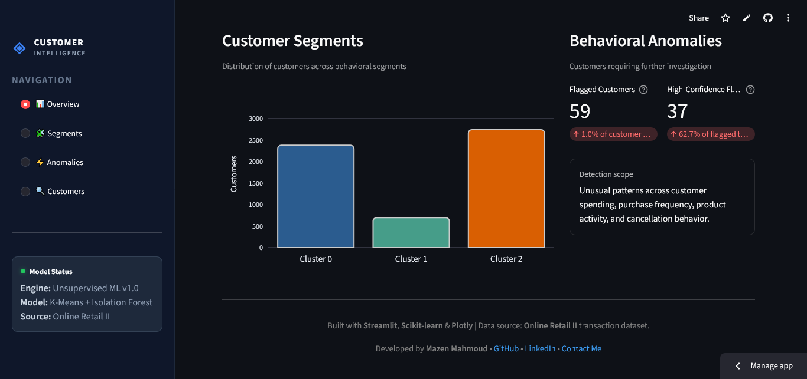
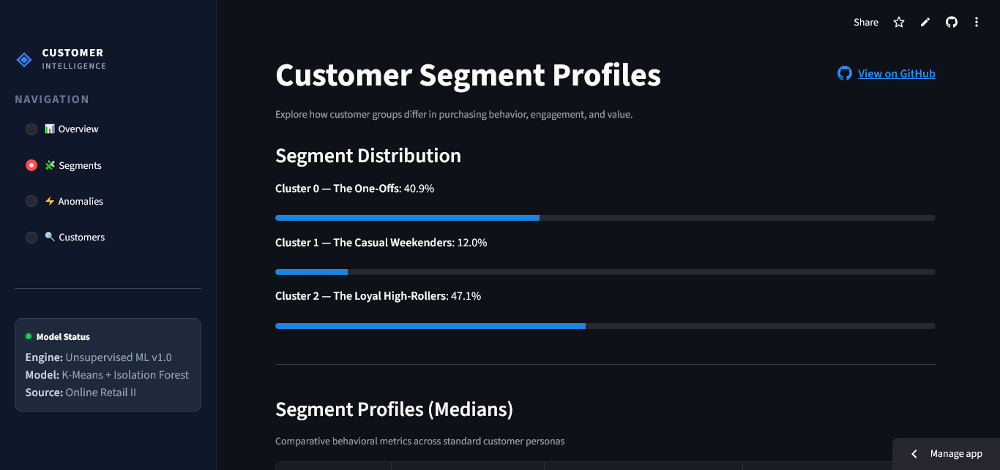

# ◈ E-Commerce Customer Intelligence Engine

### Unsupervised Customer Segmentation & Behavioral Anomaly Detection

[](https://www.python.org/)
[](https://streamlit.io/)
[](https://scikit-learn.org/)
[](LICENSE)

> An end-to-end unsupervised machine learning project that transforms transaction-level e-commerce data into customer-level behavioral intelligence through customer segmentation and behavioral anomaly detection.

**🌐 Live Demo:**  https://e-commerce-customer-intelligence-8cyyb8fxaodney235mykll.streamlit.app/

---

## 📸 Dashboard Preview

### Executive Overview


### Segment Distribution & Anomaly Summary



### Customer Segment Profiles



---

## 📌 Project Overview

Understanding customer behavior is fundamental to customer relationship management, retention analysis, and targeted engagement.

This project converts raw e-commerce transactions into a **customer-level behavioral dataset** and applies unsupervised machine learning to answer two core questions:

> **1. How do customers differ in their purchasing behavior?**

> **2. Which customers exhibit unusually different behavioral patterns?**

### Key Technical Capabilities
* **Granular Feature Engineering:** Aggregates raw transactional rows into a customer-level behavioral matrix, engineering metrics for purchasing patterns, basket metrics, weekend bias, and cancellation behavior.
* **Dual Unsupervised Modeling:** Operates segmentation and anomaly detection as parallel, non-interfering analytical dimensions.
* **Production-Grade Architecture:** Decouples ML training from inference via serialized Scikit-learn pipelines (`joblib`) and presents results through a custom-styled Streamlit application.

---

## 📊 Dataset & Cleaning Pipeline

The underlying data source is the **Online Retail II** dataset, containing historical transaction records from a UK-based online retailer.

## Data Cleaning Protocol
To preserve signal integrity and eliminate transactional noise:
* **Identification:** Filtered out records lacking a valid `Customer ID`.
* **Normalization:** Stripped whitespace from categorical descriptions and standardized `Customer ID` types.
* **Data Hygiene:** Removed duplicate rows and non-positive prices/quantities from the primary purchase dataset.
* **Cancellation Isolation:** Separated cancelled orders (`Invoice` starting with `'C'`) into a secondary tracking stream. Rather than discarding cancellations, they were aggregated at the customer level to engineer a dedicated `CancellationRate` feature.

---

## 📐 Customer-Level Feature Engineering

The cleaned transaction-level log is aggregated to construct a robust behavioral matrix per customer:

| Feature | Category | Description & Business Value |
| :--- | :--- | :--- |
| `Monetary` | Spend | Total lifetime expenditure across all valid orders. |
| `Frequency` | Volume | Count of distinct completed purchase invoices. |
| `Recency` | Inactivity | Days elapsed between the customer's last purchase and dataset cutoff. |
| `CustomerLifetime` | Tenure | Days between a customer's first and most recent transaction. |
| `TotalItemsPurchased` | Volume | Total unit volume across all lifetime orders. |
| `UniqueProducts` | Variety | Count of distinct stock codes purchased. |
| `AverageOrderValue` | Basket Size | Mean monetary spend per completed invoice (`Monetary / Frequency`). |
| `AverageItemsPerOrder` | Basket Depth | Mean item quantity per completed invoice. |
| `PurchaseRate` | Velocity | Order frequency normalized over active tenure (`Frequency / Lifetime`). |
| `WeekendPurchaseRatio` | Engagement | Ratio of weekend purchases to total orders (captures lifestyle timing). |
| `CancellationRate` | Risk | Ratio of cancelled invoices to total attempted orders. |

---

## 🔬 Exploratory Analysis & Preprocessing

### Statistical Handling
* **Variance Stabilization:** Highly skewed distribution variables (such as `Monetary` and `TotalItemsPurchased`) were transformed using `np.log1p()` to stabilize variance.
* **Scaling Strategy:** Standard scaling was evaluated against `RobustScaler`. Given that customer behavior naturally contains extreme valid values (e.g., high-volume commercial buyers), `RobustScaler` was selected to prevent extreme values from distorting feature means.

### Dimensionality Reduction (PCA Variance)
Principal Component Analysis (PCA) was used to project the multi-dimensional feature space into a 2D landscape for visual clustering analysis:

| Scaling Approach | PC1 Variance | PC2 Variance | PC3 Variance | Cumulative (First 3 PCs) |
| :--- | :--- | :--- | :--- | :--- |
| **Standard-Scaled** | 48.51% | 14.48% | 9.50% | **72.49%** |
| **Robust-Scaled** | 36.61% | 32.58% | 11.66% | **80.85%** |

---

## 🧩 Clustering & Customer Personas

Multiple algorithms (K-Means, Agglomerative Clustering, GMM, DBSCAN) and hyperparameter variations were evaluated using Silhouette, Calinski-Harabasz, and Davies-Bouldin metrics. 

**Final Selection:** K-Means with **3 Clusters** was selected. While alternative configurations yielded marginally higher internal mathematical scores, the 3-cluster solution provided the most stable, interpretable, and actionable segment sizes for marketing operations.

### Profile Breakdown
* **Cluster 0 — The One-Offs**
  * **Behavioral Median:** `Frequency: 1.0` | `Lifetime: 0 days` | `Recency: 284 days`
  * **Business Profile:** Accounts that completed a single transaction with no subsequent repeat activity. Primary targets for win-back campaigns.
* **Cluster 1 — The Casual Weekenders**
  * **Behavioral Median:** `WeekendPurchaseRatio: 0.78` | `Moderate Spend`
  * **Business Profile:** Highly specialized shoppers whose activity is heavily concentrated on Saturdays and Sundays. Ideal targets for weekend-only promotional pushes.
* **Cluster 2 — The Loyal High-Rollers**
  * **Behavioral Median:** `Frequency: 6.0` | `Recency: 43 days` | `Monetary: $2,286.19`
  * **Business Profile:** High-velocity, highly recent, high-value accounts driving core revenue. Primary targets for loyalty VIP programs.

---

## ⚡ Behavioral Anomaly Detection

Anomaly detection is executed using **Isolation Forest** (supported by comparative runs with Local Outlier Factor and One-Class SVM).

### Architectural Independence
To maintain schema purity, the K-Means cluster assignment is **not** fed into the Isolation Forest. Segmentation and anomaly detection run as parallel pipelines. Every customer profile receives distinct metadata:
$$\text{Customer ID} \longrightarrow \big[\text{Cluster Assignment}\big] \ \otimes \ \big[\text{Is\_Anomaly}, \text{Anomaly\_Score}\big]$$

---

## 🖥️ Streamlit Dashboard Architecture

The frontend application is built using Streamlit, styled via an external `style.css` file to enforce dark-mode themes, and orchestrated across four primary navigation tabs:

1. **📊 Overview:** Executive metric cards, population metrics, and interactive 2D PCA cluster landscapes.
2. **🧩 Segments:** Detailed segment profile comparisons, population progress indicators, and median feature variance tables.
3. **⚡ Anomalies:** Isolation Forest triage queue, anomaly density histograms, and high-confidence flag tables.
4. **🔍 Customers:** Individual account inspection portal providing individual persona tags, deviation scores, and raw feature metrics.

---

## 🏗️ Project Architecture

```text
E-Commerce-Customer-Intelligence/
│
├── app.py                      # Main Streamlit application and router
├── style.css                   # Custom dark-theme UI styling
├── components/
│   ├── __init__.py
│   └── ui_blocks.py            # Modular rendering functions for UI tabs
├── src/
│   ├── __init__.py
│   ├── cleaning.py             # Transaction cleaning routines
│   ├── feature_engineering.py  # Customer aggregation logic
│   ├── preprocessing.py        # Scaler & transformer builders
│   └── inference.py            # Batch inference pipeline runner
├── notebooks/
│   ├── 01_data_understanding_eda.ipynb
│   ├── 02_feature_analysis.ipynb
│   ├── 03_preprocessing_pca.ipynb
│   ├── 04_clustering_experiments.ipynb
│   ├── 05_cluster_profiling.ipynb
│   └── 06_anomaly_detection.ipynb
├── models/
│   ├── preprocessor_robust.joblib
│   ├── clustering_model.joblib
│   └── anomaly_inference_pipeline.joblib
├── assets/                     # Screenshots and visual media
├── requirements.txt            # Dependency tracking
├── LICENSE                     # MIT License
└── README.md                   # Project documentation

---

## Author

**Mazen Mahmoud**

- Contact: [mazen.mahmoud420409@gmail.com](mailto:mazen.mahmoud420409@gmail.com)
- LinkedIn: https://www.linkedin.com/in/mazen-mahmoud-ds

---

## Contribution
Contributions are always welcome! If you'd like to improve this project, feel free to fork the repository, make your changes, and submit a pull request.

---